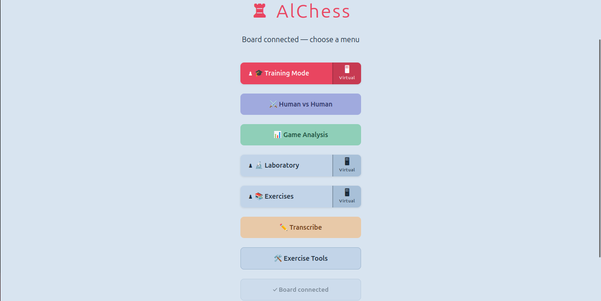
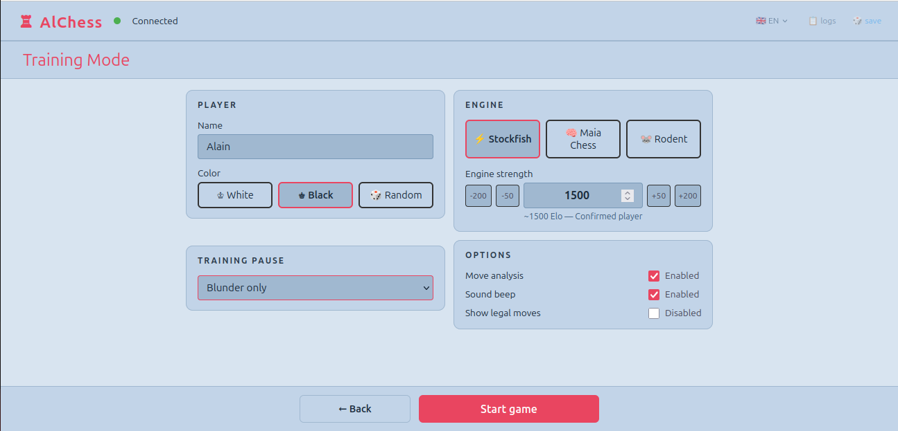
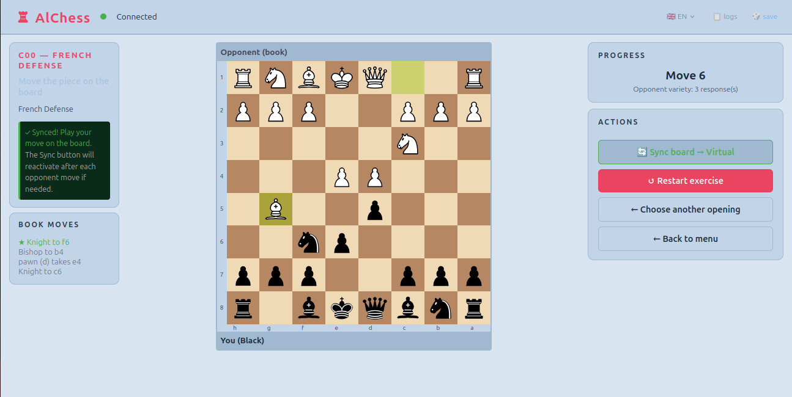
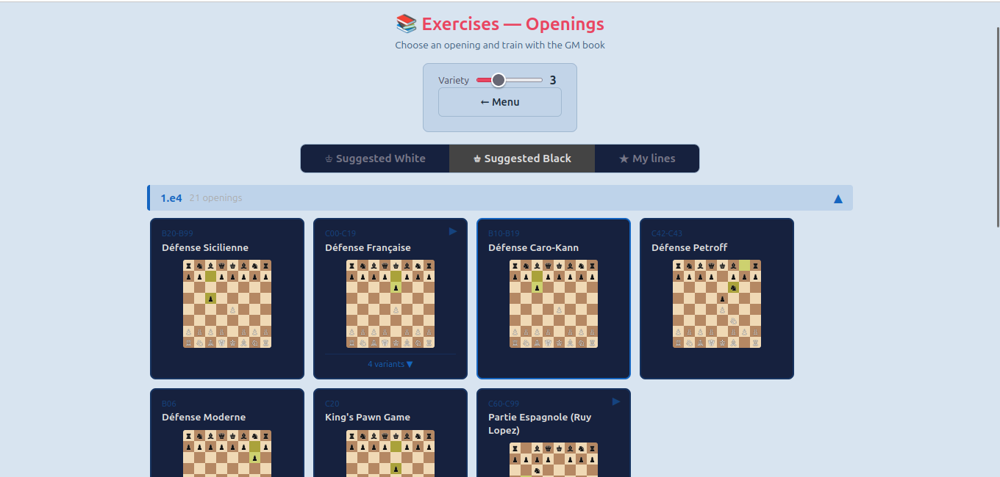

# AlChess

**🇫🇷 Français** | [🇬🇧 English below](#english)

[](https://github.com/AlainDelree/AlChess/releases/latest)
[](LICENSE)




---

## 🇫🇷 Français

Application d'entraînement aux échecs qui connecte un échiquier physique **Chessnut Air** à une interface web locale. Jouez contre Stockfish ou Maia, entraînez vos ouvertures, analysez vos parties — sur votre vrai échiquier. La plupart des modes fonctionnent aussi **sans matériel**, grâce à l'échiquier virtuel intégré (seul le mode Humain contre Humain requiert l'échiquier physique).

### ⬇️ Téléchargement (méthode recommandée)

Pas besoin de connaître Git ou Python. Rendez-vous sur la page **[Releases](https://github.com/AlainDelree/AlChess/releases/latest)** et téléchargez le paquet correspondant à votre système.

**Windows 10 / 11**
1. Téléchargez `AlChess-vX.Y.Z-windows-x86_64.zip` depuis les [Releases](https://github.com/AlainDelree/AlChess/releases/latest)
2. Extrayez le ZIP (clic droit → « Extraire tout »)
3. Double-cliquez sur **`1-Installer.bat`** — le script installe Python si nécessaire, prépare l'environnement, télécharge les moteurs et crée un raccourci **AlChess** sur le Bureau
4. Lancez AlChess avec **`2-Lancer_AlChess.bat`** (ou le raccourci **AlChess** créé sur le Bureau) — l'interface s'ouvre dans votre navigateur

> ℹ️ Ne fermez pas la fenêtre PowerShell pendant l'utilisation.

**Linux (Ubuntu 22.04 / 24.04)**
1. Téléchargez `AlChess-vX.Y.Z-linux-x86_64.zip` depuis les [Releases](https://github.com/AlainDelree/AlChess/releases/latest)
2. Extrayez-le, puis dans un terminal :
   ```bash
   cd AlChess-vX.Y.Z-linux-x86_64
   ./install.sh
   ./start_alchess.sh
   ```

### Fonctionnalités

- ♟️ **Mode entraînement** — jouez contre Stockfish ou Maia, avec évaluation et feedback à chaque coup
- 👥 **Humain vs Humain** — deux joueurs sur le même échiquier physique
- 📖 **Exercices d'ouvertures** — entraînement sur des livres GM ou vos propres lignes
- 🔍 **Analyse de partie** — navigation coup par coup, détection des erreurs, import de PGN externes (ex : Chess.com)
- 📝 **Retranscription PGN** — rejouez et exportez vos parties
- 🧪 **Mode Labo** — échiquier virtuel sans matériel physique
- 🌐 **Interface multilingue** — français, anglais et allemand (🇫🇷 🇬🇧 🇩🇪)

### Aperçu

**Mode entraînement** — choix du moteur, du niveau Elo et des options d'analyse :



**Exercices d'ouvertures** — entraînez-vous sur un répertoire, guidé par le livre :





### Moteurs d'échecs

Les moteurs sont mis en place **automatiquement par l'installeur**, avec le binaire adapté à votre système.

| Moteur | Rôle |
|--------|------|
| Stockfish | Adversaire fort, évaluation pédagogique |
| Maia (lc0) | Adversaire au jeu « humain », par niveau Elo |
| Rodent IV | Adversaire à personnalités variées *(à venir sous Windows)* |

### Systèmes et matériel

| Système | Support |
|---------|---------|
| Ubuntu 22.04 / 24.04 (x86_64) | ✅ |
| Windows 10 / 11 (x86_64) | ✅ |

> ⚠️ Le Chessnut Air+ a un `idProduct` différent du Chessnut Air — vérifiez avec `lsusb | grep 2d80` (Linux) ou le Gestionnaire de périphériques (Windows).

### Installation depuis les sources (développeurs)

```bash
git clone https://github.com/AlainDelree/AlChess.git ~/AlChess
cd ~/AlChess
python3 -m venv venv
source venv/bin/activate
pip install -r requirements.txt
python -m nicsoft.web
```

Guide complet : [`INSTALLATION/`](INSTALLATION/).

### Contribuer

Les contributions sont les bienvenues ! Ouvrez une **Issue** pour signaler un bug ou proposer une fonctionnalité, ou une **Pull Request** pour soumettre du code.

### Licence

GNU General Public License v3.0 — voir [LICENSE](LICENSE).

---

<a name="english"></a>
## 🇬🇧 English

A chess training application that connects a **Chessnut Air** physical chessboard to a local web interface. Play against Stockfish or Maia, train your openings, analyze your games — on your real board. Most modes also work **without hardware**, thanks to the built-in virtual chessboard (only Human vs Human requires the physical board).

### ⬇️ Download (recommended)

No need to know Git or Python. Go to the **[Releases](https://github.com/AlainDelree/AlChess/releases/latest)** page and download the package for your system.

**Windows 10 / 11**
1. Download `AlChess-vX.Y.Z-windows-x86_64.zip` from the [Releases](https://github.com/AlainDelree/AlChess/releases/latest)
2. Extract the ZIP (right-click → "Extract All")
3. Double-click **`1-Installer.bat`** — it installs Python if needed, sets up the environment, downloads the engines and creates an **AlChess** shortcut on the Desktop
4. Launch AlChess with **`2-Lancer_AlChess.bat`** (or the **AlChess** shortcut created on the Desktop) — the interface opens in your browser

> ℹ️ Do not close the PowerShell window while using the app.

**Linux (Ubuntu 22.04 / 24.04)**
1. Download `AlChess-vX.Y.Z-linux-x86_64.zip` from the [Releases](https://github.com/AlainDelree/AlChess/releases/latest)
2. Extract it, then in a terminal:
   ```bash
   cd AlChess-vX.Y.Z-linux-x86_64
   ./install.sh
   ./start_alchess.sh
   ```

### Features

- ♟️ **Training mode** — play against Stockfish or Maia, with per-move evaluation and feedback
- 👥 **Human vs Human** — two players on the same physical board
- 📖 **Opening exercises** — train on GM books or your own lines
- 🔍 **Game analysis** — move-by-move navigation, mistake detection, import external PGN files (e.g. Chess.com)
- 📝 **PGN retranscription** — replay and export your games
- 🧪 **Lab mode** — virtual board without physical hardware
- 🌐 **Multilingual interface** — French, English and German (🇫🇷 🇬🇧 🇩🇪)

### Screenshots

**Training mode** — pick the engine, Elo level and analysis options:


**Opening exercises** — practice a repertoire, guided by the book:


### Chess engines

Engines are set up **automatically by the installer**, with the binary matching your system.

| Engine | Role |
|--------|------|
| Stockfish | Strong opponent, evaluation & feedback |
| Maia (lc0) | Human-like opponent, by Elo level |
| Rodent IV | Opponent with varied personalities *(Windows build coming)* |

### Systems and hardware

| System | Support |
|--------|---------|
| Ubuntu 22.04 / 24.04 (x86_64) | ✅ |
| Windows 10 / 11 (x86_64) | ✅ |

> ⚠️ The Chessnut Air+ has a different `idProduct` from the Chessnut Air — check with `lsusb | grep 2d80` (Linux) or Device Manager (Windows).

### Install from source (developers)

```bash
git clone https://github.com/AlainDelree/AlChess.git ~/AlChess
cd ~/AlChess
python3 -m venv venv
source venv/bin/activate
pip install -r requirements.txt
python -m nicsoft.web
```

Full guide: [`INSTALLATION/`](INSTALLATION/).

### Contributing

Contributions are welcome! Open an **Issue** to report a bug or suggest a feature, or a **Pull Request** to submit code.

### License

GNU General Public License v3.0 — see [LICENSE](LICENSE).
